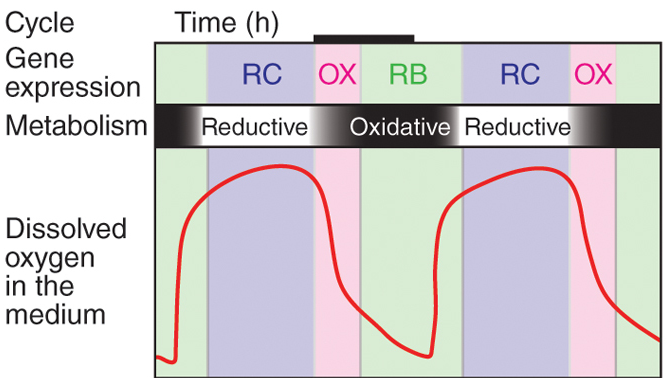
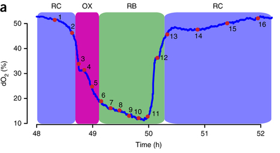

```{r setup, include=FALSE}
knitr::opts_chunk$set(echo = TRUE)
knitr::opts_chunk$set(cache = TRUE)
```

## Overview

1. RNA-Seq Analysis with DESeq2
1. Exploratory Analysis

## Install Software

```{r, eval = F}
## try http:// if https:// URLs are not supported
source("https://bioconductor.org/biocLite.R")
biocLite()

source("https://bioconductor.org/biocLite.R")
biocLite(c("Rsubread", "DESeq2"))
```

```{r, message = F, warning = F}
library(tidyverse)
library(Rsubread)
library(DESeq2)
```

## Experimental Details
  RNA-Seq libraries were taken from a [study](https://www.ncbi.nlm.nih.gov/pmc/articles/PMC4190017/) on the Yeast Metabolic Cycle (YMC). Yeast cultures spontaneously will synchronize their metabolism when grown under limiting glucose conditions. The yeast will cycle through oxidative and reductive stages and exhibit dramatic oscillations in gene expression throughout the cycle. 
  




  I downloaded RNA-Seq data in fastq format through the Gene Expression Omnibus ([GEO](https://www.ncbi.nlm.nih.gov/geo/query/acc.cgi?acc=GSE52339)), using the `fastq-dump` command line tool from the `sra-toolkit`. 
  
  Libraries 8-10, and 13-15 were downloaded and aligned to the Cerevisae genome using tophat following the methods described in the paper. 
  
## FeatureCounts
  First let's create a set of variables that list where our annotation files are located and our BAM alignment files. 
  
```{r, message = F, warning = F}
# make variable that points to our annotation
gtf <- "dbases/genes.gtf"

# list.files will make a vector of file names
bams <- list.files("data/bams/", 
            full.names = T, 
            pattern = "subsampled.bam$", 
            recursive = T)

#run featureCounts
fc_SE <- featureCounts(files = bams,
                       annot.ext=gtf,
                       isGTFAnnotationFile = TRUE, 
                       GTF.featureType="exon",
                       GTF.attrType="gene_id")
```

## DESeq2
  Next, we'' use
```{r deseq}
metadata <- read_tsv("data/metadata.txt")

metadata$files <- bams
metadata$stage <- factor(c(rep("RB", 3), 
                          rep("RC", 3)))

colnames(fc_SE$counts) <- metadata$time

dds <- DESeqDataSetFromMatrix(countData = fc_SE$counts,
                              colData = metadata,
                              design = ~ stage)

dds <- DESeq(dds)
res <- results(dds)
res
```

  The output from DESeq is in a non-dataframe object, so next we'll transform it into a dataframe. 
```{r tidy_data}
res <- as.data.frame(res) %>% 
  mutate(genes = rownames(res)) %>% 
  select(genes, everything()) %>% 
  as_data_frame()  
```


```{r plot}
# make MA plot
ggplot(res, aes(log2(baseMean), log2FoldChange)) + 
  geom_point() + theme_bw()

# ifelse is a useful function for classifying rows
res <- res %>% 
  mutate(sig_genes = ifelse(padj < 0.01, 
                            "significant", 
                            "not_significant"))

# plot with colour
ggplot(res, aes(log2(baseMean), log2FoldChange, colour = sig_genes)) + 
  geom_point() + 
  scale_color_brewer(palette = "Set1") +
  theme_bw()
```


```{r compute_summary_statistics}
res %>% 
  group_by(sig_genes) %>%
  summarize(sig = n())
```

## Annotate Genes
  Now that we have a tidy dataset of differentially expressed genes, let's annotate them with additional information. [Ensembl](http://uswest.ensembl.org/index.html) has an easy to use interface called `BioMart` that is useful to downloading information about genes. 
  
  Go to BioMart and download the following annotations for Yeast:
- Gene ID 
- Associated Gene Name
- GO Term Accession  
- GO Term Name

Exercises:

1. Join the `res` table with the annotations downloaded from BioMart
1. Identify the most common GO term names for `GO domain == biological_process` for significantly DE genes, and not significant genes. 
1. What is the most differentially expressed gene that is involved in `oxidation-reduction process`? First find most significant, then find most downregulated and also significant. 

```{r}
annotations <- read_tsv("dbases/mart_export.txt.gz")

annotations <- dplyr::rename(annotations, 
                      genes = `Gene ID`,
                      gene_name = `Associated Gene Name`,
                      go_term_id = `GO Term Accession`,
                      go_term = `GO Term Name`,
                      go_domain = `GO domain`)

res_annotated <- left_join(res, annotations, by = "genes")
```

```{r ex2}
dplyr::filter(res_annotated, go_domain == "biological_process") %>% 
  group_by(sig_genes, go_term) %>% 
  summarize(count_of_term = n()) %>% 
  arrange(desc(count_of_term)) %>% 
  na.omit() %>% 
  dplyr::slice(1:5)
```

```{r ex3}
dplyr::filter(res_annotated, go_term == "oxidation-reduction process") %>% 
  arrange(padj) %>%
  dplyr::slice(1)

dplyr::filter(res_annotated, 
              go_term == "oxidation-reduction process",
              padj < 0.05) %>% 
  arrange(log2FoldChange) %>% 
  dplyr::slice(1)
```
