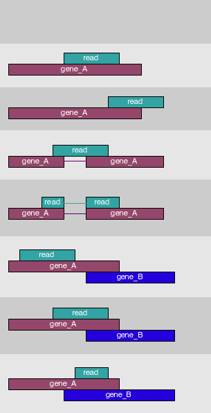

<style type="text/css">

#.reveal section body{ /* Normal  */
#   font-size: 12px;
#}
#.reveal section td {  /* Table  */
#   font-size: 8px;
#}
#.reveal section h1 { /* Header 1 */
# font-size: 28px;
# color: DarkBlue;
#}
#.reveal section h2 { /* Header 2 */
# font-size: 22px;
# color: DarkBlue;
#}
#.reveal section h3 { /* Header 3 */
# font-size: 18px;
# color: DarkBlue;
#}
.reveal section code { /* Code block */
  font-size: 0.75em;
}
.reveal section pre { /* Code block */
  font-size: 0.75em
}
</style>


RNA-Seq Tutorial
========================================================
author: Kent Riemondy
date: 03/14/2017
autosize: true


Outline
========================================================

- Introduce RNA-Seq Methods and Analysis
- RNA-Seq Vignette
- EDA analysis

What is RNA-Seq?
========================================================


<small>Computation for ChIP-seq and RNA-seq studies. Nature Methods 2009. </small>

Types of RNA-Seq methods
========================================================


- Poly-A+/-Seq
- 3'end-Seq
- Clip-Seq
- Ribo-Seq
- RNA modification-seqs
- Single-Cell RNA-Seq

Tools for mRNA-Seq Analysis
========================================================
incremental: true

- <small>Align reads to genome
  * Bowtie2 
  * **Tophat2/Hisat2** 
  * STAR 
  * Kallisto/Salmon  
- Count reads per gene
  * **featureCounts (Rsubread R pkg)**
  * HTSeq-count (Python script)
  * Bedtools multicov (Command line C++)
  * RSEM/Kallisto/Salmon (Command line C++)
</small>

***

- <small>Differential Expression
  * **DESeq2**
  * edgeR
  * Sleuth (works with Kallisto/RSEM)
  * Alpine 
- Exploratory Data Analysis
  * Heatmaps (Complex Heatmap (R pkg))
  * GO analysis (TopGO, DAVID)
  * GSEA (Broad Insitute)
  * Clustering (`prcomp()`, `kmeans()`)
</small>

How to count reads per gene?
=========================================================
right: 40%
incremental: true

- Assign alignment to a genome feature (gene/transcript/exon)
- How to handle reads that align to multiple places?
- How much overlap necessary?
- How to handle overlapping annotations?
- One approach
  * Count only high quality alignments (*uniquely aligned*) 
  * Discard alignments overlapping multiple annotations
  
***


<small>Modified from HTSeq [documentation](http://www-huber.embl.de/users/anders/HTSeq/doc/index.html). </small>

Count Matrix
=========================================================


```r
head(countData)
```

```
            treated1 treated2 treated3 untreated1 untreated2 untreated3
FBgn0000003        0        0        1          0          0          0
FBgn0000008      140       88       70         92        161         76
FBgn0000014        4        0        0          5          1          0
FBgn0000015        1        0        0          0          2          1
FBgn0000017     6205     3072     3334       4664       8714       3564
FBgn0000018      722      299      308        583        761        245
            untreated4
FBgn0000003          0
FBgn0000008         70
FBgn0000014          0
FBgn0000015          2
FBgn0000017       3150
FBgn0000018        310
```

<small>
To generate a count matrix you need:
- Alignment files ([BAM](https://samtools.github.io/hts-specs/SAMv1.pdf))
- Annotation file (Gene Transfer Format [GTF](http://uswest.ensembl.org/info/data/ftp/index.html), [description](http://plants.ensembl.org/info/website/upload/gff.html))
- featureCounts, HTSeq-Count, Bedtools 
</small>
Differential Expression, more than Fold-Changes
=========================================================
left: 10%
title: FALSE
***


Differential Expression, part ii
=========================================================
left: 10%
title: FALSE
***


Basic Steps for DESeq2 analysis
=========================================================

- Normalize between different samples (reduce effects from different sequencing depths)
- estimate dispersion for each gene to fit a model
- fit to a negative binomial glm. 
- perform statistical tests based on supplied model design


```r
# single factor
design = ~ treatment

#multiple factor
design = ~ treatment + disease
```
<small> DESeq2 [paper](http://genomebiology.biomedcentral.com/articles/10.1186/s13059-014-0550-8) </small>
